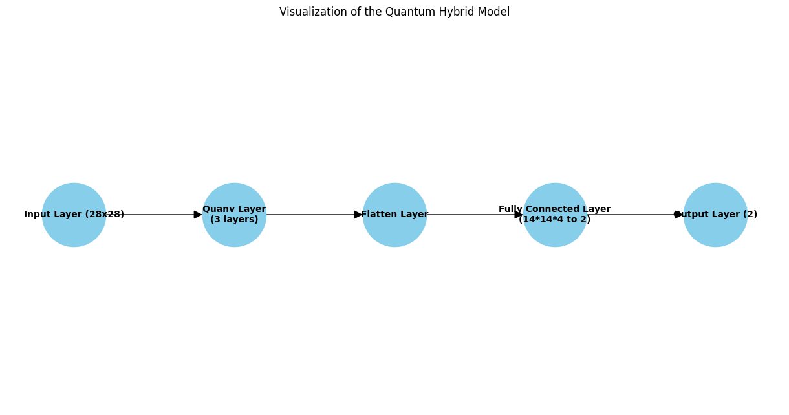
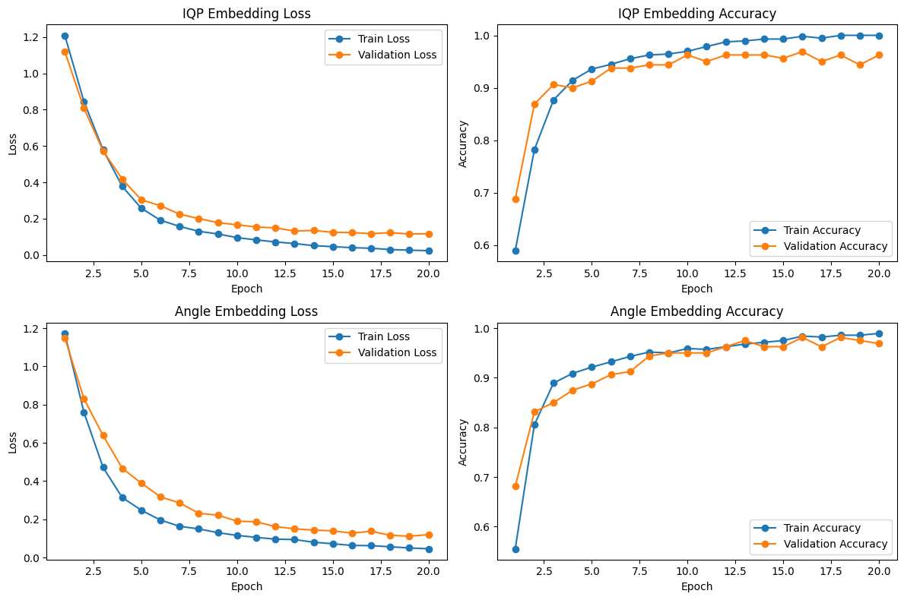

# QML-for-Conspicuity-Detection-in-Production
Womanium Quantum+AI 2024 Projects

**Please review the participation guidelines [here](https://github.com/womanium-quantum/Quantum-AI-2024) before starting the project.**

_**Do NOT delete/ edit the format of this read.me file.**_

_**Include all necessary information only as per the given format.**_

## Project Information:

### Team Size:
  - Maximum team size = 2
  - While individual participation is also welcome, we highly recommend team participation :)

### Eligibility:
  - All nationalities, genders, and age groups are welcome to participate in the projects.
  - All team participants must be enrolled in Womanium Quantum+AI 2024.
  - Everyone is eligible to participate in this project and win Womanium grants.
  - All successful project submissions earn the Womanium Project Certificate.
  - Best participants win Womanium QSL fellowships with Fraunhofer ITWM. Please review the eligibility criteria for QSL fellowships in the project description below.

### Project Description:
  - Click [here](https://drive.google.com/file/d/1AcctFeXjchtEhYzPUsHpP_b4HGlI4kq9/view?usp=sharing) to view the project description.
  - YouTube recording of the project description - [link](https://youtu.be/Ac1ihFcTRTc?si=i6AIVfQQh8ymYQYp)

## Project Submission:
All information in this section will be considered for project submission and judging.

Ensure your repository is public and submitted by **August 9, 2024, 23:59pm US ET**.

Ensure your repository does not contain any personal or team tokens/access information to access backends. Ensure your repository does not contain any third-party intellectual property (logos, company names, copied literature, or code). Any resources used must be open source or appropriately referenced.

### Team Information:
Team Member 1:
 - Full Name: Tushar Pandey
 - Womanium Program Enrollment ID (see Welcome Email, format- WQ24-xxxxxxxxxxxxxxx): WQ24-gvf0DfBcoFyCheL

Team Member 2:
 - Full Name: Nadine Matondo-Mvula
 - Womanium Program Enrollment ID (see Welcome Email, format- WQ24-xxxxxxxxxxxxxxx): WQ24-PNHFQ5C9fEiqKaZ

### Project Solution:
The TIG Aluminium 5083 dataset is a 6-class dataset consisting of 26,666 training images and 6,588 test images. For our classification problem, we used a Quanvolutional Neural Network, where the convolutional layer is implemented as a quantum circuit with trainable parameters alongside a classical fully connected layer.

We trained the model on both 2-class and 4-class subsets, where for each class, we randomly selected 200-500 samples. These samples were split into training, validation, and test sets using a 70-20-10 ratio.
Further, we used performance metrics to evaluate our model. 

The 2-class classification problem achieved a test accuracy of 96.6% with an F1 score of 0.98, ROC of 0.96, precision of 0.99, recall of 0.97, and a confusion matrix of [[50, 3], [7, 240]]. In contrast, the original paper achieved a test accuracy of 95% using a classical CNN. This demonstrates that the hybrid model outperforms the classical one. 

The 4-class classification problem we achieved a test accuracy of 98.5% witn an F1 score of 0.99, ROC of 1, precision of 0.99, recall of 0.98, and a confusion matrix of [[56,0,2,0], [0,50,0,0], [1,0,45,0], [0,0,0,46]]. The original paper achieved an accuracy of 71%, therefore demonstrating a much powerful improvement through the hybrid quantum model.

We have the results for the different embeddings we tried to encode the data for a quantum layers with a constraint of 4 qubits. We also show how different sampling effects different classification scores.
[Results](https://docs.google.com/spreadsheets/d/13_O17s-6w6qbXTOjDOFBNW5nJvJB9Tefj1J1Cp3sRCs/edit?usp=sharing)

### Multi-Class IQP Embedding vs. Angle Embedding Training Results

### Overview

The training process was conducted over 20 epochs for both models, with the performance metrics recorded for both training and validation phases. The key metrics mentioned here are loss and accuracy. 

### Training Results

### IQP Embedding

- **Training Loss**: Decreased from 1.2098 to 0.0232
- **Validation Loss**: Decreased from 1.1213 to 0.1163
- **Training Accuracy**: Increased from 0.5893 to 1.0000
- **Validation Accuracy**: Increased from 0.6875 to 0.9625
- **Best Validation Loss**: 0.1153
- **Best Validation Accuracy**: 0.9688

### Angle Embedding

- **Training Loss**: Decreased from 1.1728 to 0.0457
- **Validation Loss**: Decreased from 1.1503 to 0.1197
- **Training Accuracy**: Increased from 0.5554 to 0.9893
- **Validation Accuracy**: Increased from 0.6813 to 0.9688
- **Best Validation Loss**: 0.1115
- **Best Validation Accuracy**: 0.9812

### Conclusion

Both models showed significant improvements in loss reduction and accuracy gain over the 20 epochs. The best results for both models were comparable, with the Angle Embedding slightly outperforming the IQP Embedding in terms of the best test accuracy.

### Two-Class IQP Embedding vs. Angle Embedding Training Results

### Training Results

### IQP Embedding

-**Current Best Validation loss**: 0.2629

-**Current Best Validation accuracy**: 0.9208

### Angle Embedding
-**Current Best Validation loss**:0.1485

-**Current Best Validation accuracy**: 0.9625

### Conclusion

For IQP Embedding, the trends show a steady decrease in both training and validation loss and a consistent increase in accuracy over the 6 epochs provided. If this trend continues: Estimated Best validation loss after 20 epochs: The validation loss might decrease further, potentially reaching around 0.20 to 0.22.
Estimated Best validation accuracy after 20 epochs: The validation accuracy might increase further, potentially reaching around 0.94 to 0.96.

For Angle Embedding, the trends show a more rapid improvement in loss and accuracy over the 14 epochs provided. If this trend continues: Estimated Best validation loss after 20 epochs: The validation loss might decrease further, potentially reaching around 0.12 to 0.14.
Estimated Best validation accuracy after 20 epochs: The validation accuracy might increase further, potentially reaching around 0.97 to 0.98.

### Project Presentation Deck:
_Link a 5min. presentation recording or deck here._
